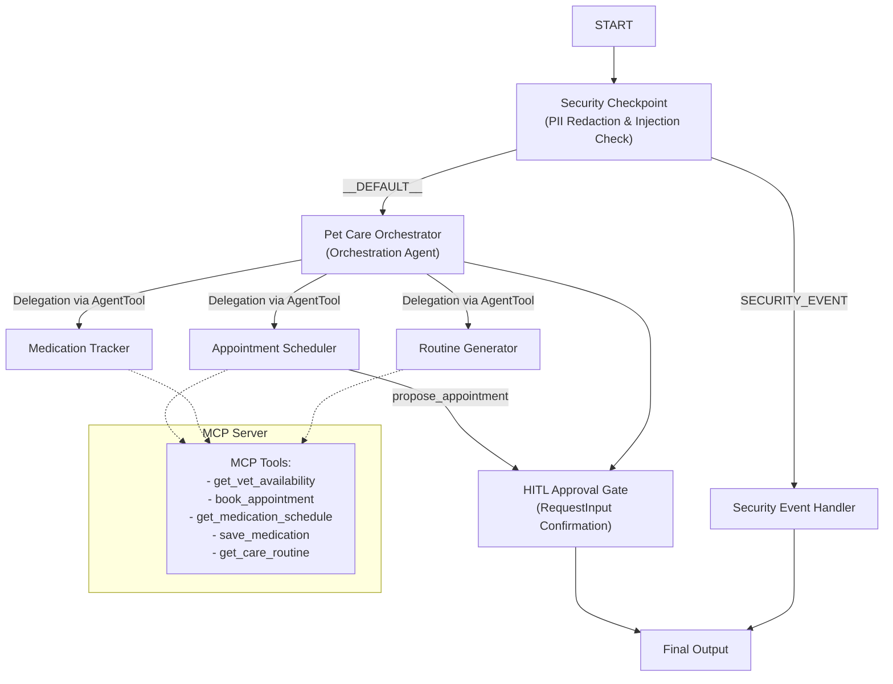

# Submission Write-Up: Pet Pal Agentic Concierge

## Problem Statement
Pet care is multi-faceted, requiring management of veterinary schedules, prescription tracking, and diet/exercise regimes. For pet owners, consolidating these tasks is fragmented across calendars, papers, and apps. At the same time, exposing pet information online raises privacy concerns, and automated booking processes require safeguards (PII scrubbing, consent check, and human-in-the-loop review) to prevent accidental bookings or incorrect treatments.

Pet Pal addresses this by providing a unified, secure, multi-agent pet care concierge.

## Solution Architecture
Below is the execution topology of Pet Pal:

## Concepts Used & Code References

1. **ADK 2.0 Workflow**: Built in [app/agent.py](file:///d:/suresh/capstone/pet-pal/app/agent.py#L239-L248) using `Workflow`, `START`, and `FunctionNode` structures to orchestrate the graph node logic.
2. **LlmAgent**: Used for specialized sub-agents (`appointment_agent`, `medication_agent`, and `routine_agent`) and the central orchestrator in [app/agent.py](file:///d:/suresh/capstone/pet-pal/app/agent.py#L48-L107).
3. **AgentTool**: Declared in [app/agent.py](file:///d:/suresh/capstone/pet-pal/app/agent.py#L93-L95) to wire sub-agent interfaces directly as tools of the orchestrator.
4. **MCP Server**: Defined in [app/mcp_server.py](file:///d:/suresh/capstone/pet-pal/app/mcp_server.py) using the Python `mcp` SDK stdio server protocol. Exposes 5 pet-specific functions.
5. **Security Checkpoint**: Implemented in [app/agent.py](file:///d:/suresh/capstone/pet-pal/app/agent.py#L117-L181) as a custom `FunctionNode` checking for PII, injections, and consent rules.
6. **Agents CLI**: Project created via `agents-cli scaffold` and synced via `uv sync` using pinned package ranges in [pyproject.toml](file:///d:/suresh/capstone/pet-pal/pyproject.toml).

## Security Design

Pet Pal implements three lines of defense:
* **PII Redaction**: Regex expressions scrub owner phone numbers and email addresses to protect user privacy in log traces.
* **Prompt Injection Detection**: Keywords (e.g. `"ignore instructions"`, `"jailbreak"`) are scanned in user prompts, routing violations immediately to a `SECURITY_EVENT` handler.
* **Surgical Procedure Consent Check**: Any request for surgical booking (e.g. neutering, operations) must explicitly include owner consent (`"consent"`, `"approve"`, or `"yes"`). Without it, the booking fails validation.
* **Audit Logging**: Every security evaluation logs a JSON structure at `INFO`, `WARNING`, or `CRITICAL` severity to record events.

## MCP Server Design
The Model Context Protocol (MCP) server runs as a local stdio subprocess in Python and exposes:
* `get_vet_availability`: Retrieves available slots.
* `book_appointment`: Commits booking after user confirmation.
* `get_medication_schedule`: Checks scheduled doses for a specific pet.
* `save_medication`: Inserts new treatment/dose schedules.
* `get_care_routine`: Yields age-appropriate diet/exercise suggestions.

## Human-in-the-Loop (HITL) Flow
To prevent accidental or incorrect vet bookings, scheduling requires approval:
1. The user asks to schedule an appointment.
2. The `appointment_agent` triggers `propose_appointment`, storing state parameters (`appointment_pending` and `appointment_details`).
3. The `hitl_approval` node yields `RequestInput`, pausing the workflow and requesting confirmation.
4. Once the user responds with `"yes"`, the workflow resumes and executes the `book_appointment` MCP tool.

## Demo Walkthrough
* **Test Case 1 (Routing)**: The user asks to see slots. The orchestrator delegates to `appointment_agent`, which calls the `get_vet_availability` MCP tool and prints the open slots.
* **Test Case 2 (HITL)**: User books a slot. The flow interrupts to ask for confirmation, then books upon receiving `"yes"`.
* **Test Case 3 (Security Violation)**: An injection attempt (e.g., `"ignore instructions"`) triggers the `SECURITY_EVENT` routing and outputs a security warning message.

## Impact & Value Statement
Pet Pal is invaluable for busy pet owners and veterinary clinics. It acts as a secure buffer that validates bookings before writing to calendars, safeguards personal contact details from being exposed to LLM endpoints unnecessarily, and delegates specialized pet issues (such as medical alerts or diet tracking) to dedicated, safety-constrained sub-agents.
